### builder, evolving.

Bangalore · India

---

**[VocalClaw](https://github.com/nickzsche21/VocalClaw_11Labs)** — run an AI agent on a local LLM at zero API cost · `115★`

**[EPFO Next](https://github.com/nickzsche21/epfo-next)** — a provident fund portal that catches claim rejections *before* you file

**[Quant Review](https://github.com/nickzsche21/quantfinancefinalboss)** — no free alpha

 

The tunnel above has no bottom. It is drawn once and loops forever —
no scripts, no scheduled jobs, nothing to keep alive.

